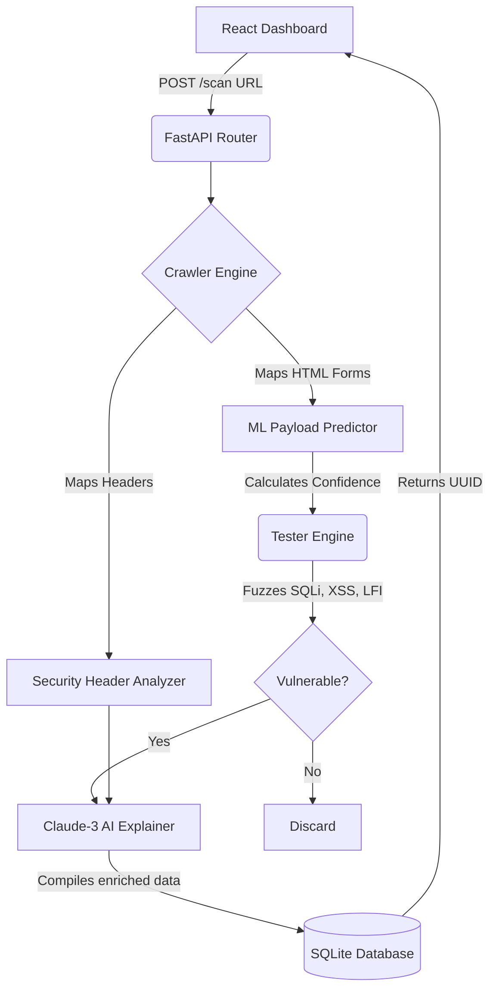
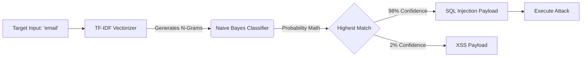

# Flux: AI-Powered Red Teaming Agent

A next-generation automated web security scanner built for speed, accuracy, and intelligence. Flux dynamically crawls targets, utilizes Machine Learning to predict successful exploit vectors, fires payloads asynchronously, and leverages **Anthropic Claude-3** to generate natural language explanations for any zero-day vulnerabilities discovered.

---

## 🧠 System Architecture

Flux is built with a decoupled architecture, operating incredibly fast via Python's asynchronous event loops and rendering dynamically on a React frontend.

### Component Overview

- **`backend/crawler.py`** - Deeply spiders the target domain, mapping the attack surface, input forms, and security headers.
- **`backend/ml/predictor.py`** - Intercepts crawling data and uses a `scikit-learn` Natural Language Pipeline to predict the optimal attack payload type (e.g. SQLi vs XSS) based on semantic form cues.
- **`backend/tester.py`** - Asynchronously fires `YAML`-based exploit payloads targeting the highest-probability vectors.
- **`backend/reporter.py`** - Passes the successful exploit triggers to the Claude-3 API to calculate impact and remediation.
- **`backend/main.py`** - The FastAPI routing orchestration layer.
- **`frontend/src/*`** - A modern, Vanilla CSS React dashboard built via Vite, featuring glassmorphism design and micro-animations.

---

## ⚙️ How It Works (Flowcharts)

### 1. The Core Attack Engine Pipeline



### 2. Machine Learning Prediction Flow

Flux uses a `TfidfVectorizer` paired with a `MultinomialNB` classifier to dynamically filter out 90% of useless network noise.



---

## 🚀 Installation & Setup

1. **Clone and change directory:**
```bash
cd "/home/viv/AI Project"
```

2. **Setup your environment:**
```bash
python3 -m venv venv
source venv/bin/activate
pip install -r requirements.txt
```

3. **Configure Settings:**
Edit the `.env` file to include your Anthropic API Key for the AI explanations to trigger.
```bash
ANTHROPIC_API_KEY=your_anthropic_api_key_here
```

---

## 🚦 Running the Application

Flux requires both the Backend API and Frontend Dashboard to be running simultaneously.

**Terminal 1 (Backend):**
```bash
source venv/bin/activate
uvicorn backend.main:app --reload --host 127.0.0.1 --port 8000
```

**Terminal 2 (Frontend):**
```bash
cd frontend
npm install
npm run dev
```

Visit the dashboard at `http://localhost:5173`!

---

## 📖 UI & Usage Guide

The AI Red Team Platform provides an incredibly sleek, dark-mode React interface.

1. **The Dashboard**: You can start a completely new vulnerability scan or instantaneously load a previous report using its secure **Private UUID**.
![Dashboard Preview] 

2. **Dynamic Live Scanning**: Paste a vulnerable test URL and execute. The engine presents a CSS-animated pulse radar while the system concurrently spiders, tests, and validates.
![Scanning a Target] 

3. **Report View**: The results appear grouped by Severity. Each vulnerability card expands to show:
   - **Target Endpoint & Raw Attack Payload**
   - **ML Confidence Score** (How certain the ML model was about the attack vector class)
   - **Claude-3 Intelligence Analysis** (Context-aware remediation advice)
![Reviewing Results] 

